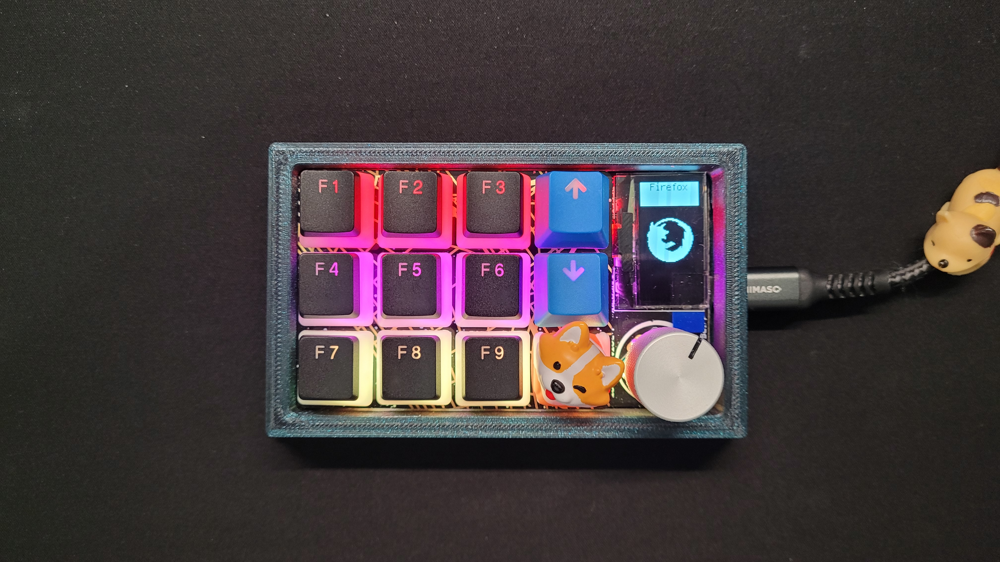

# Overview
This repository redesigns the [RP2040 Macropad](https://learn.adafruit.com/adafruit-macropad-rp2040/overview) to be oriented at a 270 degrees (USB-C on the right).

Refer to `horizontal_macro_template.py` to creating any additional macros.

# Features
- Sleep and Lock after no usage for 50 minutes.
- Supports displaying logos from `/images`folder
  - if animation is `True` in macro, then image only moves horizontally
- Hotkey hints displayed after consecutively pressing the encoder 3 times
- Display label when button is pressed